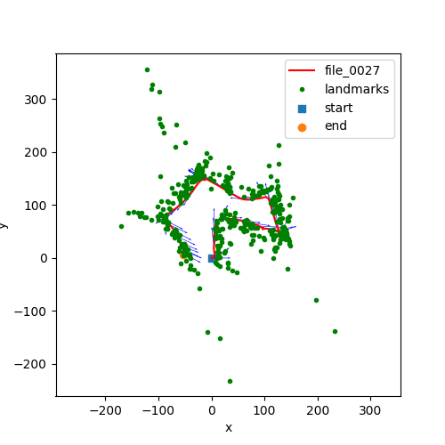

# SLAM-using-Extended-Kalman-Filter

Course Project for Sensing and Estimation Robotics ECE 276A

### Task Description:

Implement visual-inertial simultaneous localization and mapping (SLAM) using the Extended Kalman
Filter. You are provided with synchronized measurements from an IMU and a stereo camera as well
as the intrinsic camera calibration and the extrinsic calibration between the two sensors, specifying the
transformation from the IMU to the left camera frame.

### Code Organisation:

```
main.py  : Computes the IMU prediction, Visual Mapping Update and the SLAM.
utils.py : Used to Load the data and to Visualize the trajectory and landmarks.
```
All the necessary functions are defined in the h3_main.py itself.

### Results:


